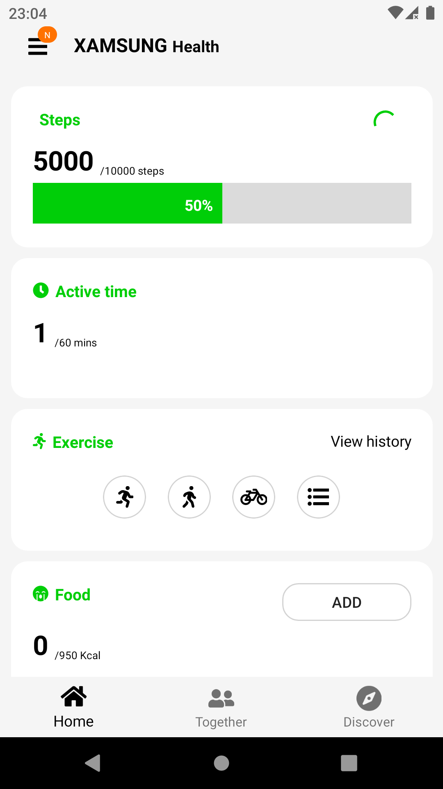
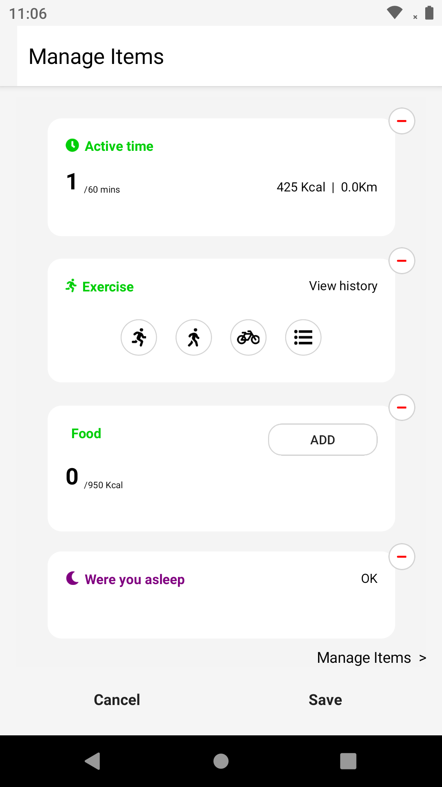
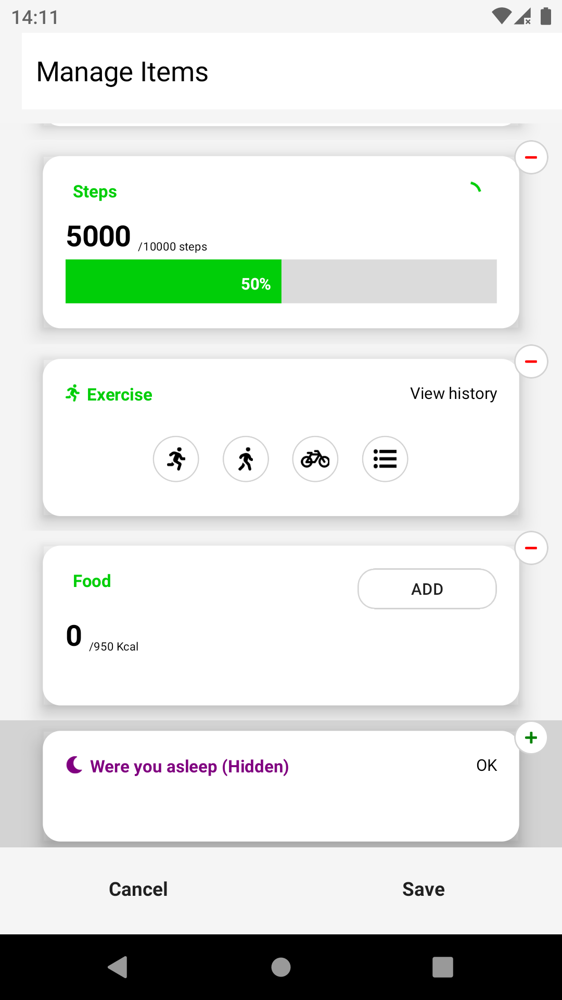

Like what you see 👀? Let me know by leaving a shiny GitHub Star⭐!

 
 
 

This project is a personal learning challenge aiming to replicate [Samsung Health](https://play.google.com/store/apps/details?id=com.sec.android.app.shealth) UI as genuine as possible while staying as much as possible in the shared code, it target Android only and it is using the following packages:
- [dotnet/System.Graphics](https://github.com/dotnet/System.Graphics)
- Some classes from [dotnet/GraphicsControls](https://github.com/dotnet/GraphicsControls)
- [Xamanimation](https://github.com/jsuarezruiz/Xamanimation)
- [Xamarin/Xamarin.CommunityToolkit](https://github.com/Xamarin/XamarinCommunityToolkit) of cource :)

### Contributions

Since I am doing this in order to learn and improve my skills, only pr for issues marked with "Help-Wanted" label will be accepted, I welcome best practises and suggetions. Got an idea on how to improve something? or spot something wrong? something could be optimized? and want to help please raise an issue.

Feel free to take this code, but please make sure you acknowledge myself.
